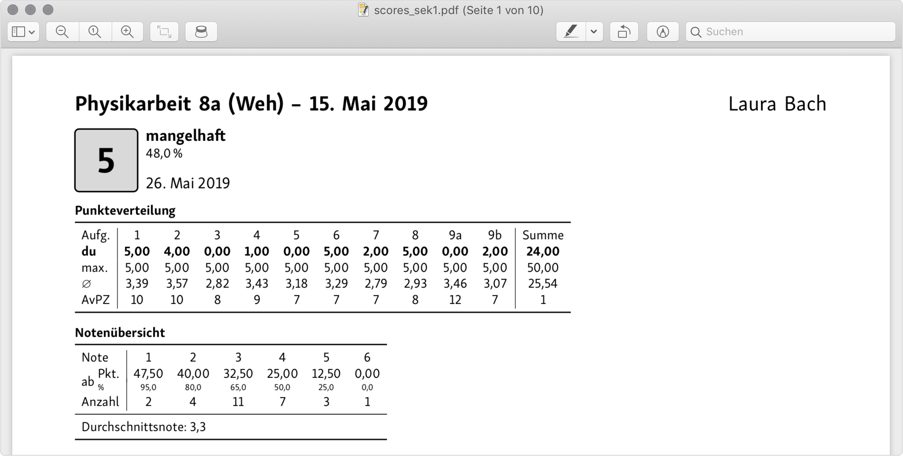
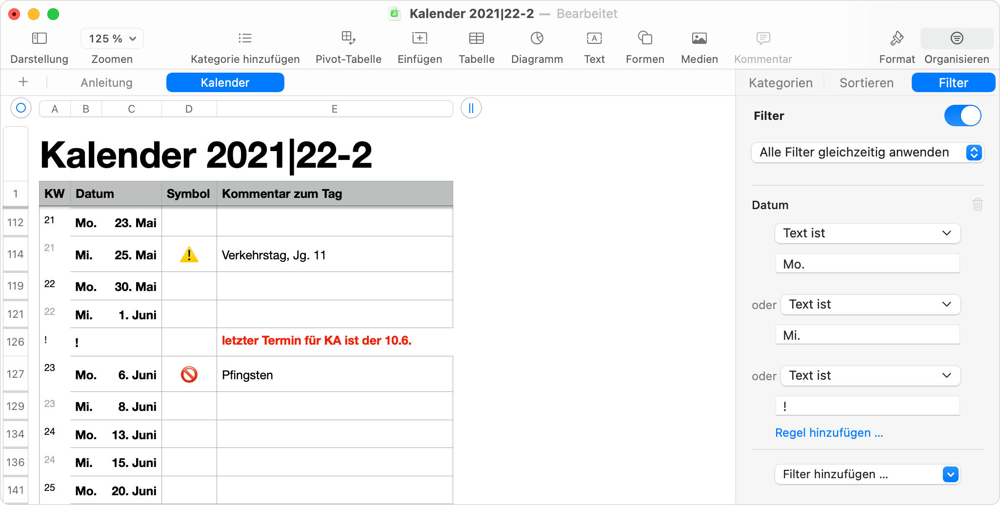
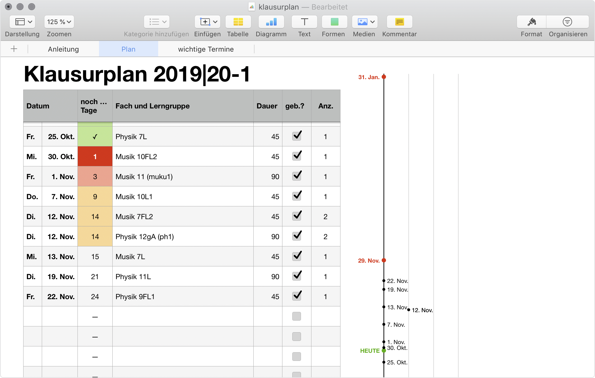
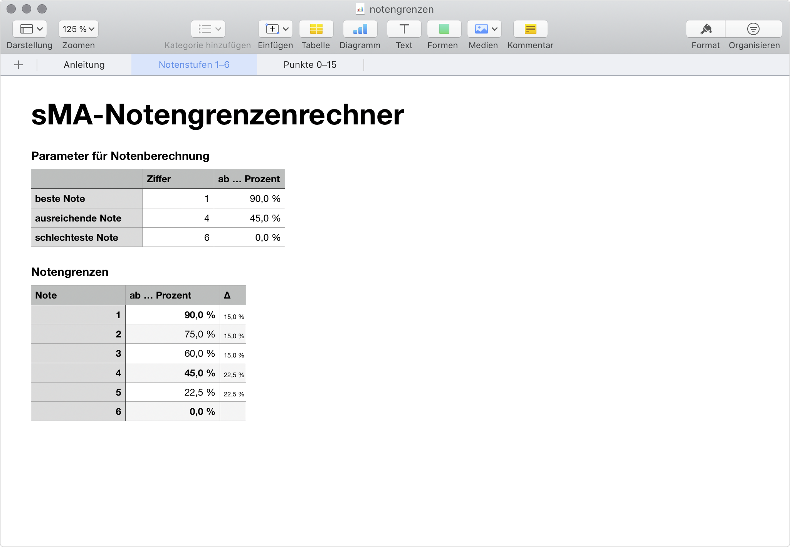
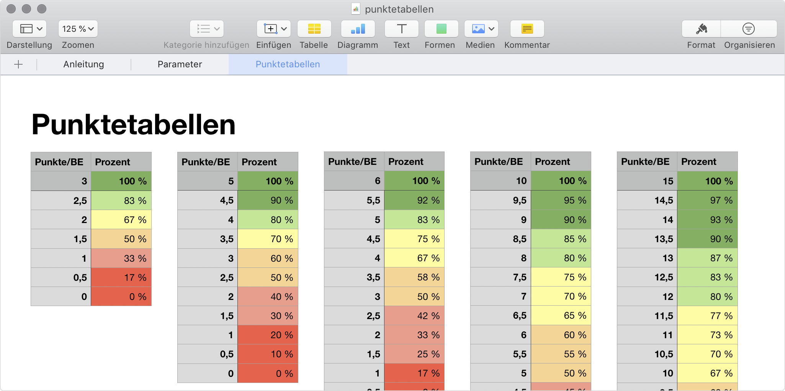
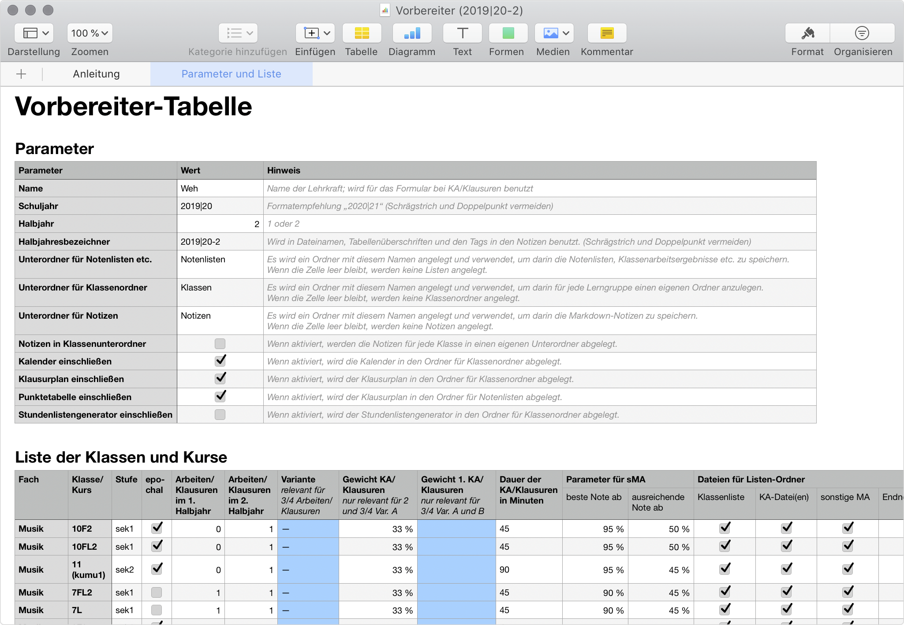
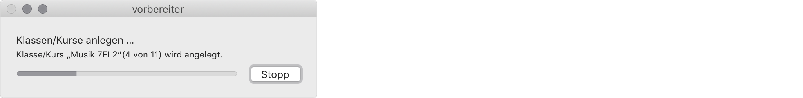
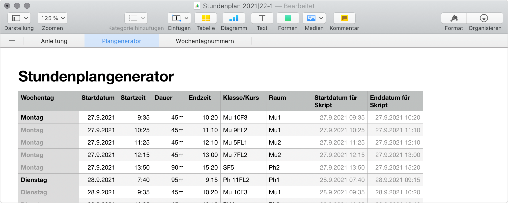
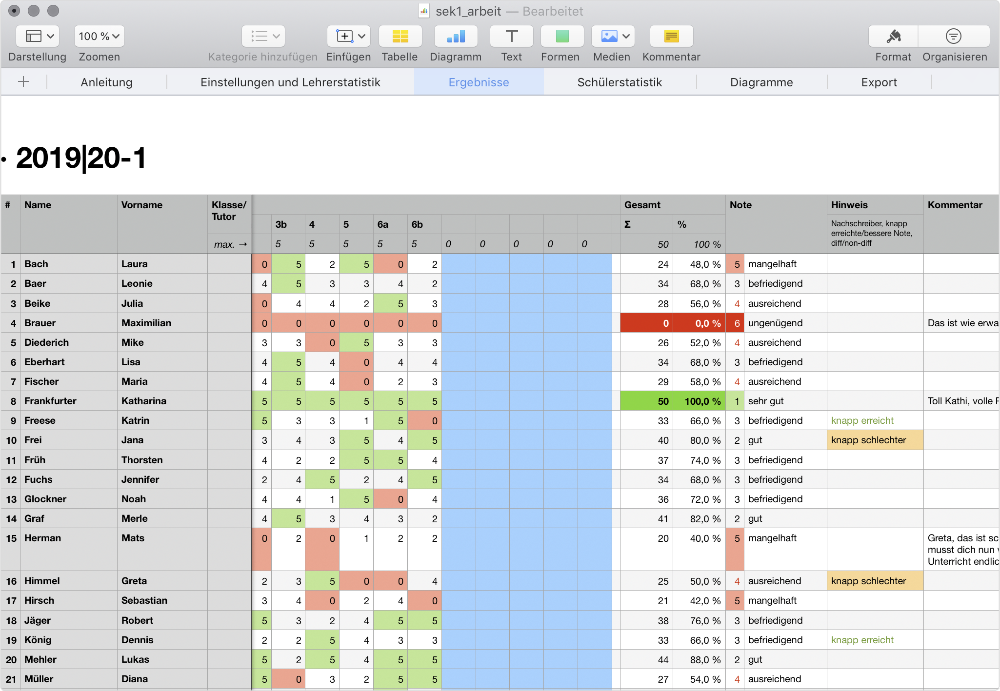

# Lehrerwerkzeuge

Dieses Repository beinhaltet (m)eine Sammlung von Dateien und Scripten zur Unterrichtsvorbereitung/-planung und Benotung. Ich stelle diese Werkzeuge hier gerne allen zur Verfügung übernehme aber grundsätzlich **keine Gewährleistung, Verantwortung oder ähnliches!** Das gilt insbesondere für die folgenden Sätze. Beim Umgang mit Schülerdaten sind selbstverständlich jeweils die gängigen Datenschutzbestimmungen zu beachten. Neben der Passwortsicherung der Geräte, nutze ich für jede Datei mit Schülerdaten ebenfalls die Passwortschutzfunktion (von Numbers).  
[Unverbindliche und nicht juristisch gesicherte Aussagen!]

Da ich diese Werzeuge für meinen persönlichen Gebrauch entwickelt habe, sind sie (teilweise) sehr eng auf meine Bedürfnisse zugeschnitten und mögen für andere nur bedingt hilfreich sein. Solltest du einen Wunsch haben oder ein Problem entdecken, kannst du dennoch gerne einen [*Issue*](https://github.com/tweh/lehrerwerkzeuge/issues) anlegen – ich verspreche aber nichts 😉.

*Hinweis: Die Namen und Daten in den Screenshots sind selbstverständlich frei erfunden.*

## Was ist enthalten?

### Ergebniseinleger

TeX- und Script-Dateien zur Erzeugung von Einlegern mit Ergebnissen von Klassenarbeiten.

### Grobplanung

Numberstabelle zur Planung der groben Unterrichtsverlaufs für ein Halbjahr in einer Lerngruppe.

### Kalender

Numberstabelle zum Planen/Eintragen aller Termine eines Halbjahres als Grundlage/Übersicht für die Grobplanung (s.o.).

### Klausurplan

Numberstabelle zum Planen/Eintragen aller Klassenarbeiten/Klausren eines Halbjahres zur besseren Übersicht. Inkl. Darstellung der Termine als Zeitleiste.

### Klassen-/Kursliste: liste

Numberstabelle für Klassenlisten (passend zu den Bewertungstabellen, s.u.). Das Tabellenblatt „Kursheft“ übernimmt die Namen aus dem ersten in der Form *Nachname, Vorname* und kann (bei passender Einstellung der Zeilenhöhe über das Tabellenformat) zum Ausdrucken und Einkleben benutzt werden. Außerdem werden Listen zur HA-Kontrolle bereitgestellt. Diese bieten beim Ausdruck auf zwei Seiten Platz für etwa 40 Kontrollen.

### Notengrenzen

Numberstabelle, zum Berechnen von Notengrenzen, wenn die Prozentwerte für die beste, die schlechteste und eine ausreichende Note (oder Punktzahl) gegeben wird. Die Notengrenzen werden dann gleichmäßig verteilt, wie es auch bei den sMA-Tabellen zum Einsatz kommt.

### Punktetabellen

Mit dieser Tabelle können als Unterstützung  bei der vergäbe von Punkten/BE die der jeweiligen Punkt-/BE-Zahl entsprechenden Prozentzahlen ausgegeben werden. Die Notenstufen 1–6 werden farbig markiert, wobei die Prozentzahl, ab welche Stufe erreicht ist, frei eingestellt werden kann.

### Script vorbereiter mit Tabelle vorbereiter_tabelle

[Video: Vorbereiter-Script in Aktion](screenshots/vorbereiter_video.mp4)

Apple-Script zum automatisierten Anlegen von Klassenordnern, Notenlisten und Notizdateien zur Unterrichtsplanung.

### Script stundenplangenerator mit Tabelle stundenplangenerator_tabelle

Apple-Script, das aus einer Numbers-Liste wiederkehrende Kalendereinträge und Erinnerungen an die Unterrichtsvorbereitung erstellt.

### Bewertungstabellen: sek1_arbeit, sek1_endnoten, sek1_sma, sek2_arbeit, sek2_endnoten, sek2_sma

Numberstabellen zur Bewertung bzw. Berechnung von

- Klassenarbeiten
- Halb- und Ganzjahresnoten
- sonstiger Mitarbeit (sMA): Mitarbeit im Unterricht, Hausaufgaben, Mappen, Sonstiges (Referate, Projekte, …)

jeweils für die Sekundarstufen 1 (Bewertung in Noten 1–6) und 2 (Bewertung in Punkten 15–0). Die Notenstufen können allerdings auch angepasst werden.

*Hinweis: Da die sMA-Tabellen etwas kompliziert sind, was das Hinzufügen/Entfernen von Schülern angeht, ist es ratsam, zunächst nur die Klassenliste (s.o.) zu füllen und erst wenn klar ist, das sich nichts mehr ändert, die Namen von dort in die Bewertungstabellen zu kopieren.*

### Stundenlistengenerator

Numberstabelle zur Erzeugung von (Roh-)Datumslisten zur Planung von Unterricht zur Verwenundg in bspw. Notizprogrammen.

## Systemvorraussetzungen

Da ich ausschließlich mit **macOS** arbeite, funktionieren die meisten Werkzeuge auch nur unter diesem Betriebssystem und erfordern in der Regel weitere Programme o.ä. Sofern nicht in der folgenden Tabelle ausgeführt wird zur Nutzung des jeweiligen Werkzeuges nur *Apple Numbers* benötigt.

| Werkzeug               | Voraussetzung                                             |
|------------------------|-----------------------------------------------------------|
| Ergebniseinleger       | vollständige TeX-Distribution, CSV-Daten aus Notentabelle |
| vorbereiter            | Apple Numbers, Klassen-/Kursliste `vorbereiter_tabelle`   |

Da Excel nicht alle Funktionen von Numbers bietet, ist es leider auch nicht möglich, ohne großen manuellen Aufwand XLSX-Versionen der Tabellen anzubieten (siehe auch [Issue #4](https://github.com/tweh/lehrerwerkzeuge/issues/4)).

## Anleitungen

Die Anleitungen zu den Numbers-Dateien finden sich jeweils auf dem ersten Blatt der Datei. Die Anleitungen zu den anderen Teilen liegen als Markdown-Datei unter gleichem Namen im selben Verzeichnis, wie das Werkzeug selbst.
