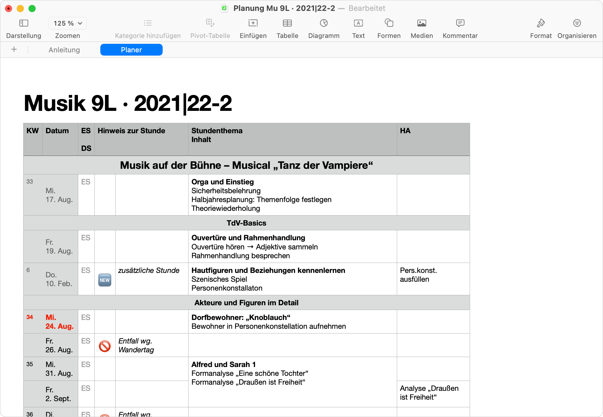
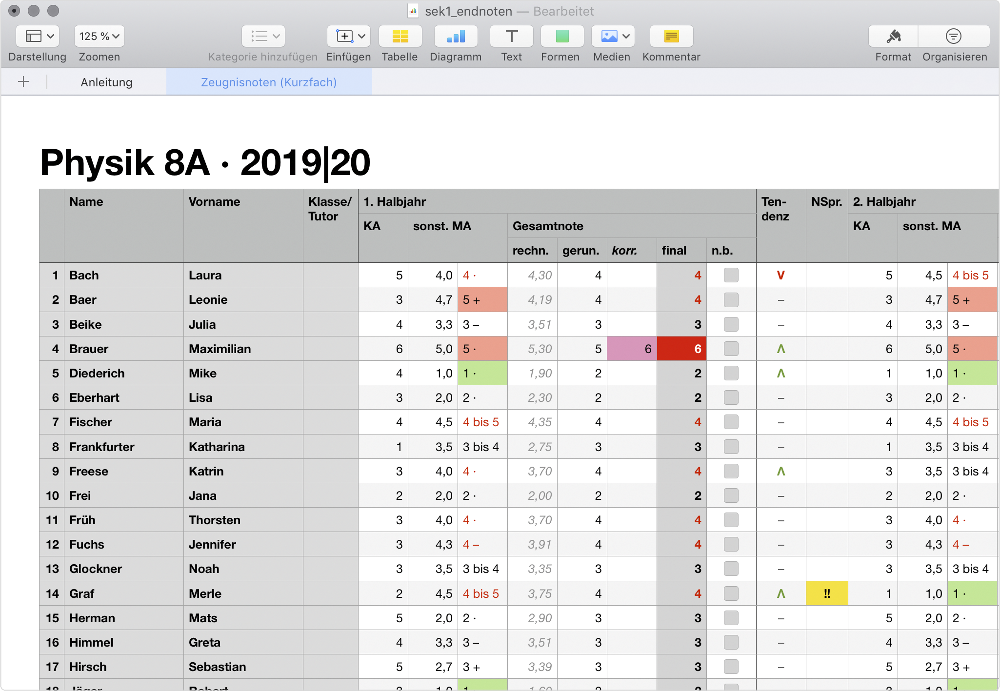
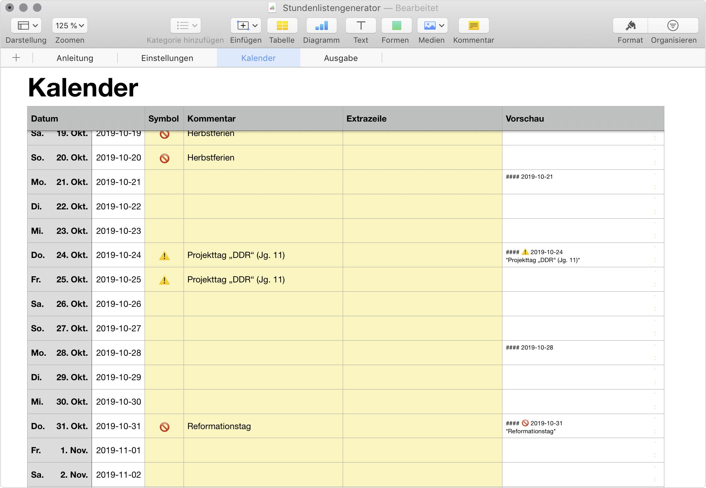

# Lehrerwerkzeuge

Dieses Repository beinhaltet (m)eine Sammlung von Dateien und Scripten zur Unterrichtsvorbereitung/-planung und Benotung. Ich stelle diese Werkzeuge hier gerne allen zur Verfügung übernehme aber grundsätzlich **keine Gewährleistung, Verantwortung oder Ähnliches!** Das gilt insbesondere für die folgenden Sätze. Beim Umgang mit Schülerdaten sind selbstverständlich jeweils die gängigen Datenschutzbestimmungen zu beachten. Neben der Passwortsicherung der Geräte, nutze ich für jede Datei mit Schülerdaten ebenfalls die Passwortfunktion. Um die Daten zwischen iPad und Mac synchronisieren nutze ich [Reselio](https://www.resilio.com), dass die Daten über ein lokales Netzwerk (z.B. beide Geräte im selben WLAN) synchronisiert und die Daten nicht über einen Server sendet, was mit der DSGVO konform sein dürfte [Unverbindliche und nicht juristisch gesicherte Aussagen!].

Da ich diese Werzeuge für meinen persönlichen Gebrauch entwickelt habe, sind sie (teilweise) sher eng auf meine Bedürfnisse zugeschnitten und mögen für andere nur bedingt hilfreich sein. Sollten Sie einen Wunsch haben oder ein Problem entdecken, können Sie gerne einen [*Issue*](https://github.com/tweh/lehrerwerkzeuge/issues) anlegen.

*Hinweis: Die Namen und Daten in den Screenshots sind selbstverständlich frei erfunden.*

## Was ist enthalten?

### Ergebniseinleger

TeX- und Script-Dateien zur Erzeugung von Einlegern mit Ergebnissen von Klassenarbeiten.

### Grobplanung

Numberstabelle zur Planung der groben Unterrichtsverlaufs für ein Halbjahr in einer Lerngruppe.

### Kalender

Numberstabelle zum Planen/Eintragen aller Termine eines Halbjahres als Grundlage/Übersicht für die Grobplanung (s.o.).

### Klassen-/Kursliste: liste

Numberstabelle für Klassenlisten (passend zu den Bewertungstabellen, s.u.). Das zweite Tabellenblatt übernimmt die Namen aus dem ersten in der Form *Nachname, Vorname* und kann (bei passender Einstellung der Zeilenhöhe über das Tabellenformat) zum Ausdrucken und Einkleben benutzt werden.

### Script prepare_classes

Shell-Script zum automatisierten Anlegen von Klassenordnern, Notenlisten und Notizdateien zur Unterrichtsplanung.

### Bewertungstabellen: sek1_arbeit, sek1_endnoten, sek1_sma, sek2_arbeit, sek2_endnoten, sek2_sma

Numberstabellen zur Bewertung bzw. Berechnung von

- Klassenarbeiten
- Halb- und Ganzjahresnoten
- sonstiger Mitarbeit (sMA): Mitarbeit im Unterricht, Hausaufgaben, Mappen, Sonstiges (Referate, Projekte, …)

jeweils für die Sekundarstufen 1 (Bewertung in Noten 1–6) und 2 (Bewertung in Punkten 15–0). Die Notenstufen können allerdings auch angepasst werden.

*Hinweis: Da die sMA-Tabellen etwas kompliziert sind, was das Hinzufügen/Entfernen von Schülern angeht, ist es ratsam, zunächst nur die Klassenliste (s.o.) zu füllen und erst wenn klar ist, das sich nichts mehr ändert, die Namen von dort in die Bewertungstabellen zu kopieren.*

### Stundenlistengenerator

Numberstabelle zur Erzeugung von (Roh-)Datumslisten zur Planung von Unterricht zur Verwenundg in bspw. Notizprogrammen.

## Systemvorraussetzungen

Da ich ausschließlich mit **macOS** arbeite, funktionieren die meisten Werkzeuge auch nur unter diesem Betriebssystem und erfordern in der Regel weitere Programme o.ä.:

| Werkzeug               | Voraussetzung                                             |
|------------------------|-----------------------------------------------------------|
| Ergebniseinleger       | vollständige TeX-Distribution, CSV-Daten aus Notentabelle |
| Grobplanung            | Apple Numbers                                             |
| Kalender               | Apple Numbers                                             |
| prepare_classes        | Shell/Terminal, Apple Numbers, Kursliste, Notentabellen   |
| sek1_arbeit, …         | Apple Numbers                                             |
| Stundenlistengenerator | Apple Numbers                                             |

## Anleitungen

Die Anleitungen zu den Numbers-Dateien finden sich jeweils auf dem ersten Blatt der Datei. Die Anleitungen zu den anderen Teilen liegen als Markdown-Datei unter gleichem Namen im selben Verzeichnis, wie das Werkzeug selbst.
